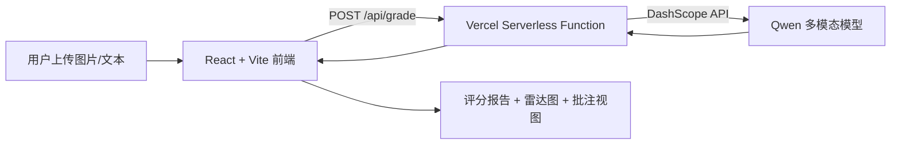

# 申论 AI 智能批改助手 | Civil Service Essay AI Coach


面向申论写作场景的全栈应用：以前端多模态输入为起点，调用大模型进行智能点评与评分，并在前端生成可视化报告与批注视图，提供完整的批改闭环体验。

## 目录
- [项目简介](#项目简介)
- [核心功能](#核心功能)
- [技术栈](#技术栈)
- [系统架构](#系统架构)
- [目录结构](#目录结构)
- [本地运行指南](#本地运行指南)
- [环境变量配置](#环境变量配置)
- [部署说明](#部署说明)

## 项目简介
本项目基于 **React 19 + Vite + TypeScript** 构建，聚焦申论批改流程：支持图片上传与文本输入，通过 **阿里云通义千问（DashScope）** 完成多维度评分与点评；前端以雷达图与批注视图呈现结果；后端采用 **Vercel Serverless Functions** 进行模型调用。

## 核心功能
- **多模态输入**：支持上传手写答卷图片，并可扩展文本粘贴模式。
- **多维度智能评分**：围绕要点完整度 / 结构逻辑 / 语言表达 / 格式规范等维度量化评分。
- **可视化报告**：雷达图与总览分数展示能力画像，辅助定位短板。
- **沉浸式批注视图**：原文对照 + AI 批注，突出亮点与扣分点。
- **BYOK 模式**：用户自备 API Key，降低成本并保障数据安全。

## 技术栈
- **前端**：React 19, TypeScript, Vite, Recharts
- **后端/API**：Vercel Serverless Functions (Node.js)
- **AI 模型**：Alibaba DashScope (Qwen 系列)
- **部署**：Vercel（CI/CD）

## 系统架构


## 目录结构
```text
/
├── api/
│   └── grade.ts            # Serverless 评分接口
├── components/
│   ├── AnnotationView.tsx  # 批注视图
│   ├── Dashboard.tsx       # 入口与导航
│   ├── Report.tsx          # 评分报告
│   └── ScoreRadar.tsx      # 雷达图
├── App.tsx                 # 视图路由与状态管理
├── index.tsx               # 应用入口
├── types.ts                # 类型定义
├── vite.config.ts          # Vite 配置
├── vercel.json             # Vercel 配置
└── package.json
```

## 本地运行指南
**前置条件**：Node.js 18+

```bash
npm install
npm run dev
```

说明：`/api/grade` 为 Vercel Serverless 路由。若需要本地联调，可使用 Vercel CLI 运行 serverless（`vercel dev`）。

## 环境变量配置
在项目根目录创建 `.env.local`：

```bash
DASHSCOPE_API_KEY=your_dashscope_api_key
GEMINI_API_KEY=optional_if_using_gemini
```

## 部署说明
推荐使用 Vercel 一键部署：
1. 将仓库连接到 Vercel
2. 配置 `DASHSCOPE_API_KEY`
3. 自动构建并发布 Serverless API 与前端静态资源

