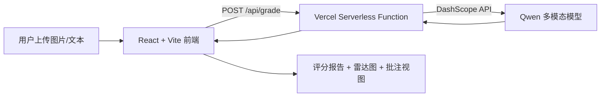

<div align="center">
  
</div>

# 📝 申论 AI 智能批改助手 | Civil Service Essay AI Coach


面向面试官的全栈示例项目：以 **Serverless + LLM** 为核心，展示从多模态输入、AI 评分、到数据可视化报告的完整闭环，强调 **AI 落地能力** 与 **工程化交付**。

## 📚 目录
- [项目简介](#-项目简介)
- [核心功能](#-核心功能)
- [技术栈](#-技术栈)
- [系统架构](#-系统架构)
- [目录结构](#-目录结构)
- [本地运行指南](#-本地运行指南)
- [环境变量配置](#-环境变量配置)
- [部署说明](#-部署说明)

## ✨ 项目简介
本项目基于 **React 19 + Vite + TypeScript** 构建，聚焦公务员申论场景，通过 **阿里云通义千问（DashScope）** 实现多模态阅卷与智能点评。前端呈现“评分报告 + 可视化雷达图 + 批注视图”，后端采用 **Vercel Serverless Functions** 承载模型调用，形成 **全栈一体化** 的 AI 批改体验。

## 🚀 核心功能
- 🧾 **多模态输入**：支持上传手写答卷图片，并可扩展文本粘贴模式。
- 🧠 **多维度智能评分**：围绕要点全面性 / 逻辑结构 / 语言精炼度 / 格式规范四个维度量化评分。
- 📊 **数据可视化仪表盘**：使用雷达图展示能力画像，帮助考生定位短板。
- 🧩 **沉浸式批注模式**：支持原文对照与 AI 批注，突出亮点与扣分点。
- 🔐 **BYOK 模式**：用户自带 API Key，降低运营成本并保障数据安全。

## 🧰 技术栈
- **前端**：React 19, TypeScript, Vite, Recharts
- **后端/API**：Vercel Serverless Functions (Node.js)
- **AI 模型**：Alibaba DashScope (Qwen 系列)
- **部署**：Vercel（CI/CD）

## 🏗️ 系统架构


## 🗂️ 目录结构
```text
/
├── api/
│   └── grade.ts            # Serverless 评分接口
├── components/
│   ├── AnnotationView.tsx  # 批注视图
│   ├── Dashboard.tsx       # 入口与导航
│   ├── Report.tsx          # 评分报告页
│   └── ScoreRadar.tsx      # 雷达图
├── App.tsx                 # 视图路由与状态管理
├── index.tsx               # 应用入口
├── types.ts                # 类型定义
├── vite.config.ts          # Vite 配置
├── vercel.json             # Vercel 配置
└── package.json
```

## 🛠️ 本地运行指南
**前置条件：** Node.js 18+

```bash
npm install
npm run dev
```

> 说明：`/api/grade` 为 Vercel Serverless 路由。若需要本地完整联调，可使用 Vercel CLI 运行 serverless（`vercel dev`）。

## 🔐 环境变量配置
在项目根目录创建 `.env.local`：

```bash
DASHSCOPE_API_KEY=your_dashscope_api_key
GEMINI_API_KEY=optional_if_using_gemini
```

## 🚢 部署说明
推荐使用 Vercel 一键部署：
1. 将仓库连接到 Vercel
2. 配置 `DASHSCOPE_API_KEY`
3. 自动构建并发布 Serverless API 与前端静态资源

---

如果你在面试中需要补充 **架构设计、模型调用策略、成本优化或安全策略**，我可以继续完善文档细节。
